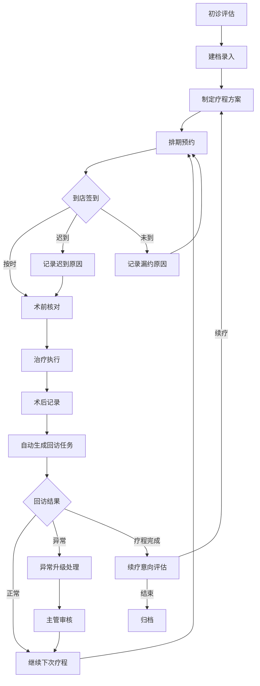

## 1. 产品概述
光子嫩肤疗程管理工作台——面向医美机构皮肤科医生、咨询师和前台协同使用的一站式 SaaS 工具，将"评估—建档—排期—复诊—续疗"全流程数字化串联，提升疗程执行质量和门店运营效率。
- 解决核心问题：纸质档案散乱、排班冲突、回访遗漏、术后异常难以追踪
- 目标用户：皮肤科医生（制定方案与记录治疗）、咨询师（跟进客户与续疗）、前台（预约排班与到店签到）、主管（质量监控与运营决策）

## 2. 核心功能

### 2.1 用户角色
| 角色 | 注册方式 | 核心权限 |
|------|----------|----------|
| 皮肤科医生 | 管理员分配账号 | 制定疗程方案、填写治疗记录、查看回访结果、查看运营看板 |
| 咨询师 | 管理员分配账号 | 管理客户档案、跟进回访任务、标记复购意向、查看运营看板 |
| 前台 | 管理员分配账号 | 预约排班、到店签到、改约/迟到/漏约记录、查看今日排期 |
| 主管 | 管理员分配账号 | 全模块查看权限、运营看板、异常反应处理、服务质量审核 |

### 2.2 功能模块
1. **客户档案**：初诊评估录入、肤质画像、面诊照片上传与部位标记、档案检索
2. **疗程方案**：3/5/定制疗程生成、单次能量档位设置、禁忌提醒、间隔天数配置
3. **预约排班**：按医生/仪器/房间查看可约时段、创建/修改/取消预约、迟到/改约/漏约原因记录
4. **治疗记录**：术前知情确认与拍照、能量档位核对、术后反应记录、冰敷与护理建议
5. **回访任务**：自动生成3天/7天/14天回访、手动创建回访、回访结果填写、异常升级
6. **运营看板**：疗程完成率、复购意向分布、异常反应热力图、客户流失预警

### 2.3 页面详情
| 页面名称 | 模块名称 | 功能描述 |
|----------|----------|----------|
| 工作台首页 | 今日概览 | 当日待治疗、待回访、新建档、异常提醒汇总卡片 |
| 客户列表 | 客户档案 | 搜索筛选、肤质标签、疗程状态、快捷创建档案 |
| 客户详情 | 初诊评估 | 肤质/斑点/红血丝/痘印象素录入、面诊照片上传与部位标记 |
| 客户详情 | 疗程方案 | 选择3次/5次/定制疗程、设置每期能量与间隔天数、禁忌项勾选 |
| 预约日历 | 预约排班 | 日/周/月视图切换、按医生/仪器/房间筛选可约时段、拖拽排期 |
| 预约详情 | 预约操作 | 创建/修改/取消预约、迟到/改约/漏约原因下拉选择 |
| 治疗执行 | 术前核对 | 知情同意确认、术前注意事项确认、术前拍照记录 |
| 治疗执行 | 术后记录 | 术后反应选择、冰敷时长、护理建议模板、异常标记 |
| 回访列表 | 回访任务 | 按状态/日期筛选、自动/手动创建任务、回访结果填写 |
| 回访详情 | 回访执行 | 客户反馈录入、满意度评分、异常升级标记、复购意向记录 |
| 运营看板 | 数据概览 | 疗程完成率趋势、复购意向饼图、异常反应分布柱状图 |
| 运营看板 | 流失预警 | 未完成疗程客户列表、超期未回访预警、异常反应客户追踪 |

## 3. 核心流程

主流程：初诊评估 → 建档 → 制定疗程方案 → 排期预约 → 到店治疗（术前核对 → 治疗执行 → 术后记录）→ 自动回访 → 复诊/续疗

## 4. 用户界面设计

### 4.1 设计风格
- 主色调：医疗级洁净白底 + 淡青绿色（#0D9488）作为品牌色，传达专业与信赖
- 辅助色：琥珀色（#D97706）用于警告/异常，玫瑰色（#E11D48）用于紧急/禁忌
- 按钮风格：圆角8px、中等阴影，主操作实心、次操作描边
- 字体：标题使用 Noto Serif SC（衬线体，传达专业感），正文使用 Noto Sans SC
- 布局风格：左侧固定导航栏 + 右侧内容区，卡片式模块分区
- 图标风格：线性图标（Lucide），统一2px描边

### 4.2 页面设计概览
| 页面名称 | 模块名称 | UI元素 |
|----------|----------|--------|
| 工作台首页 | 今日概览 | 4张统计卡片（渐变底色+图标）、待办列表、异常提醒横幅 |
| 客户列表 | 客户档案 | 搜索栏、筛选标签组、客户卡片网格（头像+肤质标签+疗程进度条） |
| 客户详情 | 初诊评估 | 表单分区（肤质/斑点/红血丝/痘印）、照片上传区+部位标记画布、保存按钮 |
| 客户详情 | 疗程方案 | 疗程选择卡片（3次/5次/定制）、每期编辑行（档位滑块+间隔输入+禁忌勾选） |
| 预约日历 | 预约排班 | 日历网格、顶部筛选条（医生/仪器/房间）、时段色块标识、拖拽交互 |
| 治疗执行 | 术前核对 | 知情确认勾选列表、术前拍照上传区、注意事项卡片 |
| 治疗执行 | 术后记录 | 反应多选标签、冰敷时长滑块、护理建议富文本、异常标记开关 |
| 回访列表 | 回访任务 | 日期切换标签、状态筛选、任务卡片（客户+到期日+状态徽章） |
| 运营看板 | 数据概览 | 折线图+饼图+柱状图组合、时间范围选择器、数据下钻交互 |

### 4.3 响应式
- 桌面优先设计，最小支持 1280px 宽度
- 平板端（768-1279px）：侧边栏折叠为图标模式，卡片网格从3列调整为2列
- 移动端（< 768px）：底部标签导航，卡片单列堆叠，日历切换为列表视图

### 4.4 3D场景引导
- 不适用，本项目无3D场景需求
