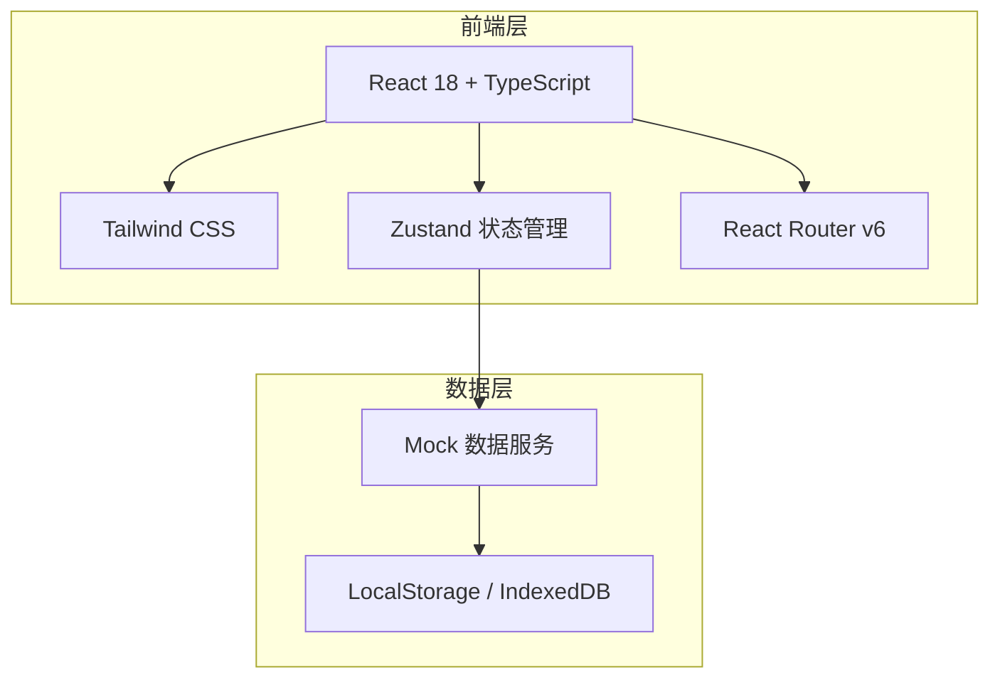
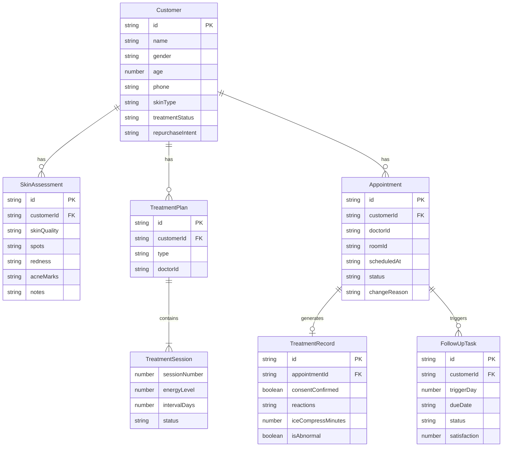

## 1. 架构设计



本项目采用纯前端架构，使用 Mock 数据服务模拟后端接口，数据持久化到 LocalStorage/IndexedDB，便于快速演示和原型验证。

## 2. 技术说明
- 前端：React@18 + TypeScript + Tailwind CSS@3 + Vite
- 初始化工具：vite-init
- 后端：无（纯前端，Mock 数据）
- 数据库：LocalStorage + IndexedDB（结构化数据 + 照片存储）
- 状态管理：Zustand
- 图表库：Recharts
- 日期处理：date-fns
- 图标库：lucide-react

## 3. 路由定义
| 路由 | 用途 |
|------|------|
| / | 工作台首页 - 今日概览 |
| /customers | 客户列表 |
| /customers/:id | 客户详情（初诊评估+疗程方案） |
| /schedule | 预约日历 |
| /treatment/:id | 治疗执行（术前核对+术后记录） |
| /follow-ups | 回访任务列表 |
| /dashboard | 运营看板 |

## 4. API 定义（Mock 服务）

### 4.1 客户相关
```typescript
interface Customer {
  id: string
  name: string
  gender: 'male' | 'female'
  age: number
  phone: string
  createdAt: string
  skinType: string
  concerns: string[]
  treatmentStatus: 'none' | 'in_progress' | 'completed'
  repurchaseIntent: 'high' | 'medium' | 'low' | 'none'
}

interface SkinAssessment {
  customerId: string
  skinQuality: 'dry' | 'neutral' | 'oily' | 'combination'
  spots: 'none' | 'mild' | 'moderate' | 'severe'
  redness: 'none' | 'mild' | 'moderate' | 'severe'
  acneMarks: 'none' | 'mild' | 'moderate' | 'severe'
  photos: SkinPhoto[]
  notes: string
}

interface SkinPhoto {
  id: string
  area: 'forehead' | 'left_cheek' | 'right_cheek' | 'nose' | 'chin' | 'full_face'
  url: string
  takenAt: string
}
```

### 4.2 疗程相关
```typescript
interface TreatmentPlan {
  id: string
  customerId: string
  type: '3_session' | '5_session' | 'custom'
  sessions: TreatmentSession[]
  contraindications: string[]
  createdAt: string
  doctorId: string
}

interface TreatmentSession {
  sessionNumber: number
  energyLevel: number
  intervalDays: number
  status: 'planned' | 'scheduled' | 'completed' | 'skipped'
  scheduledDate?: string
}
```

### 4.3 预约相关
```typescript
interface Appointment {
  id: string
  customerId: string
  doctorId: string
  roomId: string
  equipmentId: string
  scheduledAt: string
  duration: number
  status: 'scheduled' | 'checked_in' | 'in_progress' | 'completed' | 'no_show' | 'rescheduled' | 'cancelled'
  changeReason?: string
  sessionNumber: number
}
```

### 4.4 治疗记录
```typescript
interface TreatmentRecord {
  id: string
  appointmentId: string
  customerId: string
  preCheck: {
    consentConfirmed: boolean
    precautionsConfirmed: boolean
    prePhotos: string[]
  }
  postRecord: {
    reactions: string[]
    iceCompressMinutes: number
    careAdvice: string
    isAbnormal: boolean
    abnormalNote?: string
  }
  recordedAt: string
}
```

### 4.5 回访任务
```typescript
interface FollowUpTask {
  id: string
  customerId: string
  appointmentId: string
  triggerDay: 3 | 7 | 14
  dueDate: string
  status: 'pending' | 'completed' | 'overdue'
  result?: {
    feedback: string
    satisfaction: 1 | 2 | 3 | 4 | 5
    isAbnormal: boolean
    repurchaseIntent?: 'high' | 'medium' | 'low' | 'none'
  }
  completedAt?: string
}
```

## 5. 服务器架构图
- 不适用（纯前端项目）

## 6. 数据模型

### 6.1 数据模型定义



### 6.2 数据定义语言
- 使用 IndexedDB 存储结构化数据，LocalStorage 存储用户偏好设置
- 照片数据以 Base64 存储，单张限制 5MB
- Mock 初始化数据在 `src/utils/mockData.ts` 中定义
